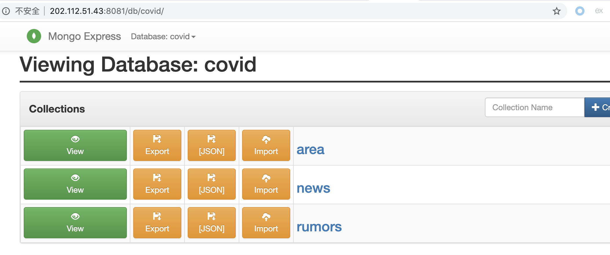
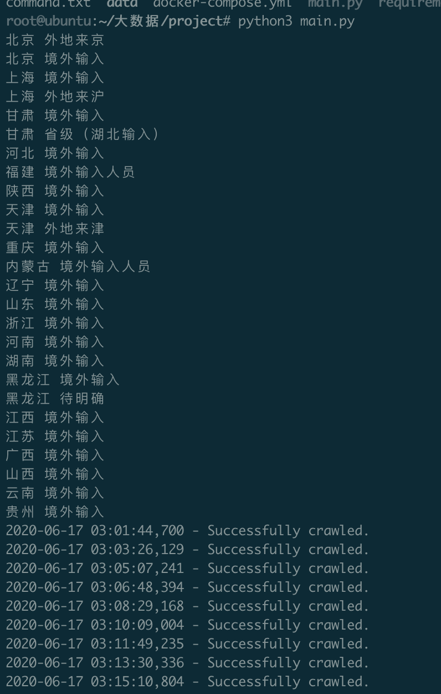
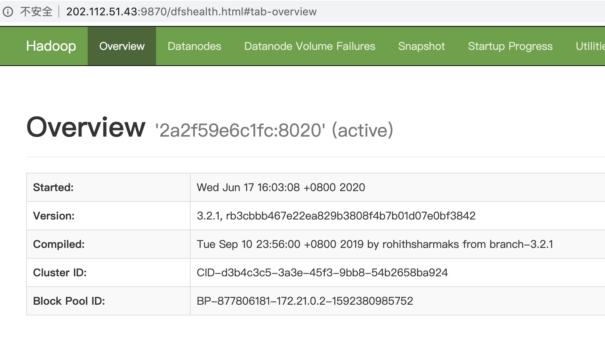

# 大数据分析与内存计算课程大作业

**总体架构**

MongoDB集群存从丁香园covid上面爬到的area，news，rumors三个collection。

Hadoop-HDFS集群存一些有关covid的文件。

**MongoDB集群架构**

- Shard:

  用于存储实际的数据块，一个shard server角色由3台机器组个一个replica set承担，防止主机单点故障

- Config Server:

  mongod实例，存储了整个 ClusterMetadata，其中包括 chunk信息。

- Query Routers:

  前端路由，客户端由此接入，且让整个集群看上去像单一数据库，前端应用可以透明使用。


共用10个节点：分片集群，1个Router-mongos，3个Config Server，2个Shard Server（replica set）每个都是1主节点2个附节点

使用了docker-compose技术，一键启动MongoDB集群

**docker-compose.yml**

```yml
version: '3'
services:
  # 分片集群，1个Router-mongos，3个Config Server，2个Shard Server（replica set）每个都是1主节点2个附节点
  configsvr0:
    container_name: configsvr0
    image: mongo
    networks:
      mongo:
        ipv4_address: 172.50.0.2
    volumes:
      - ./configsvr0/data/db:/data/db
      - ./configsvr0/data/configdb:/data/configdb
    command: --configsvr --replSet "rs_configsvr" --bind_ip_all
    restart: always
  configsvr1:
    container_name: configsvr1
    image: mongo
    networks:
      mongo:
        ipv4_address: 172.50.0.3
    volumes:
      - ./configsvr1/data/db:/data/db
      - ./configsvr1/data/configdb:/data/configdb
    command: --configsvr --replSet "rs_configsvr" --bind_ip_all
    restart: always
  configsvr2:
    container_name: configsvr2
    image: mongo
    networks:
      mongo:
        ipv4_address: 172.50.0.4
    volumes:
      - ./configsvr2/data/db:/data/db
      - ./configsvr2/data/configdb:/data/configdb
    command: --configsvr --replSet "rs_configsvr" --bind_ip_all
    restart: always
  shardsvr00:
    container_name: shardsvr00
    networks:
      mongo:
        ipv4_address: 172.50.0.5
    image: mongo
    volumes:
      - ./shardsvr00/data/db:/data/db
      - ./shardsvr00/data/configdb:/data/configdb
    command: --shardsvr --replSet "rs_shardsvr0" --bind_ip_all
    restart: always
    depends_on:
      - configsvr0
      - configsvr1
      - configsvr2
  shardsvr01:
    container_name: shardsvr01
    networks:
      mongo:
        ipv4_address: 172.50.0.6
    image: mongo
    volumes:
      - ./shardsvr01/data/db:/data/db
      - ./shardsvr01/data/configdb:/data/configdb
    command: --shardsvr --replSet "rs_shardsvr0" --bind_ip_all
    restart: always
    depends_on:
      - configsvr0
      - configsvr1
      - configsvr2
  shardsvr02:
    container_name: shardsvr02
    networks:
      mongo:
        ipv4_address: 172.50.0.7
    image: mongo
    volumes:
      - ./shardsvr02/data/db:/data/db
      - ./shardsvr02/data/configdb:/data/configdb
    command: --shardsvr --replSet "rs_shardsvr0" --bind_ip_all
    restart: always
    depends_on:
      - configsvr0
      - configsvr1
      - configsvr2
  shardsvr10:
    container_name: shardsvr10
    networks:
      mongo:
        ipv4_address: 172.50.0.9
    image: mongo
    volumes:
      - ./shardsvr10/data/db:/data/db
      - ./shardsvr10/data/configdb:/data/configdb
    command: --shardsvr --replSet "rs_shardsvr1" --bind_ip_all
    restart: always
    depends_on:
      - configsvr0
      - configsvr1
      - configsvr2
  shardsvr11:
    container_name: shardsvr11
    networks:
      mongo:
        ipv4_address: 172.50.0.10
    image: mongo
    volumes:
      - ./shardsvr11/data/db:/data/db
      - ./shardsvr11/data/configdb:/data/configdb
    command: --shardsvr --replSet "rs_shardsvr1" --bind_ip_all
    restart: always
    depends_on:
      - configsvr0
      - configsvr1
      - configsvr2
  shardsvr12:
    container_name: shardsvr12
    networks:
      mongo:
        ipv4_address: 172.50.0.11
    image: mongo
    volumes:
      - ./shardsvr12/data/db:/data/db
      - ./shardsvr12/data/configdb:/data/configdb
    command: --shardsvr --replSet "rs_shardsvr1" --bind_ip_all
    restart: always
    depends_on:
      - configsvr0
      - configsvr1
      - configsvr2
  mongos:
    container_name: mongos
    networks:
      mongo:
        ipv4_address: 172.50.0.8
    image: mongo
    volumes:
      - ./mongos/data/db:/data/db
      - ./mongos/data/configdb:/data/configdb
    entrypoint: mongos
    command: --configdb rs_configsvr/172.50.0.2:27019,172.50.0.3:27019,172.50.0.4:27019 --bind_ip_all
    depends_on:
      - shardsvr00
      - shardsvr01
      - shardsvr02
      - shardsvr10
      - shardsvr11
      - shardsvr12

networks:
  mongo:
    driver: bridge
    ipam:
      config:
        - subnet: 172.50.0.1/24

```

节点启动成功，并映射出各个容器内的存储文件


依次执行下述命令，完成mongo集群的搭建，以及导入之前爬虫爬到的历史文件。

```bash
#configsvr0
#创建配置服务复制集
mongo --host 172.50.0.2 --port 27019
rs.initiate(
  {
    _id: "rs_configsvr",
    configsvr: true,
    members: [
      { _id : 0, host : "172.50.0.2:27019" },
      { _id : 1, host : "172.50.0.3:27019" },
      { _id : 2, host : "172.50.0.4:27019" }
    ]
  }
)
exit

#shardsvr00
#创建分片复制集
mongo --host 172.50.0.5 --port 27018
rs.initiate(
  {
    _id : "rs_shardsvr0",
    members: [
      { _id : 0, host : "172.50.0.5:27018" },
      { _id : 1, host : "172.50.0.6:27018" },
      { _id : 2, host : "172.50.0.7:27018" }
    ]
  }
)
exit
#shardsvr10
mongo --host 172.50.0.9 --port 27018
rs.initiate(
  {
    _id : "rs_shardsvr1",
    members: [
      { _id : 0, host : "172.50.0.9:27018" },
      { _id : 1, host : "172.50.0.10:27018" },
      { _id : 2, host : "172.50.0.11:27018" }
    ]
  }
)
exit

#mongos
#增加shardsvr到集群
mongo --host 172.50.0.8 --port 27017
sh.addShard("rs_shardsvr0/172.50.0.5:27018,172.50.0.6:27018,172.50.0.7:27018")
sh.addShard("rs_shardsvr1/172.50.0.9:27018,172.50.0.10:27018,172.50.0.11:27018")


#向mongos导入之前爬虫爬到的历史文件
mongoimport --host 172.50.0.8 --port 27017 -d covid -c area --file area.dat
mongoimport --host 172.50.0.8 --port 27017 -d covid -c news --file news.dat
mongoimport --host 172.50.0.8 --port 27017 -d covid -c rumors --file rumors.dat
```


**mongo-express**

运行mongo-express可以作为数据查询展示

```bash
docker run -id --rm -p 8081:8081 --link mongos:mongo --net _mongo mongo-express
```




**数据更新**

一天运行一遍爬虫脚本，可以从丁香园上爬去数据并更新到mongo集群数据库中

```bash
python3 main.py
```




**Hadoop-HDFS**

一个namenode两个datenode

**docker-compose.yml**

```yml
version: "3"

services:
  namenode:
    image: bde2020/hadoop-namenode:2.0.0-hadoop3.2.1-java8
    container_name: namenode
    restart: always
    ports:
      - 9870:9870
      - 9000:9000
    volumes:
      - hadoop_namenode:/hadoop/dfs/name
    environment:
      - CLUSTER_NAME=test
    env_file:
      - ./hadoop.env
    networks:
      hadoopnet:
        ipv4_address: 172.21.0.2

  datanode1:
    image: bde2020/hadoop-datanode:2.0.0-hadoop3.2.1-java8
    container_name: datanode1
    restart: always
    hostname: 172.21.0.3
    volumes:
      - hadoop_datanode1:/hadoop/dfs/data
    environment:
      SERVICE_PRECONDITION: "namenode:9870"
    env_file:
      - ./hadoop.env
    networks:
      hadoopnet:
        ipv4_address: 172.21.0.3

  datanode2:
    image: bde2020/hadoop-datanode:2.0.0-hadoop3.2.1-java8
    container_name: datanode2
    restart: always
    hostname: 172.21.0.4
    volumes:
      - hadoop_datanode2:/hadoop/dfs/data
    environment:
      SERVICE_PRECONDITION: "namenode:9870"
    env_file:
      - ./hadoop.env
    networks:
      hadoopnet:
        ipv4_address: 172.21.0.4

  resourcemanager:
    image: bde2020/hadoop-resourcemanager:2.0.0-hadoop3.2.1-java8
    container_name: resourcemanager
    restart: always
    environment:
      SERVICE_PRECONDITION: "namenode:9000 namenode:9870 datanode:9864"
    env_file:
      - ./hadoop.env
    networks:
      hadoopnet:
        ipv4_address: 172.21.0.5

  nodemanager1:
    image: bde2020/hadoop-nodemanager:2.0.0-hadoop3.2.1-java8
    container_name: nodemanager
    restart: always
    environment:
      SERVICE_PRECONDITION: "namenode:9000 namenode:9870 datanode:9864 resourcemanager:8088"
    env_file:
      - ./hadoop.env
    networks:
      hadoopnet:
        ipv4_address: 172.21.0.6

  historyserver:
    image: bde2020/hadoop-historyserver:2.0.0-hadoop3.2.1-java8
    container_name: historyserver
    restart: always
    environment:
      SERVICE_PRECONDITION: "namenode:9000 namenode:9870 datanode:9864 resourcemanager:8088"
    volumes:
      - hadoop_historyserver:/hadoop/yarn/timeline
    env_file:
      - ./hadoop.env
    networks:
      hadoopnet:
        ipv4_address: 172.21.0.7

volumes:
  hadoop_namenode:
  hadoop_datanode1:
  hadoop_datanode2:
  hadoop_historyserver:

networks:
  hadoopnet:
    driver: bridge
    ipam:
      driver: default
      config:
      -
        subnet: 172.21.0.0/24
```


在hadoop节点启动后，可以将covid相关文件导入到HDFS中

**Insert2hdfs.py**

```python
#!/usr/bin/env python3
from tqdm import tqdm
from hdfs import *
import os

class pyhdfs(object):
    """docstring for pyhdfs"""
    def __init__(self, ip,port):
        self.ip = ip
        self.port = port
        self.url = 'http://'+self.ip+':'+self.port
        self.client = Client(self.url)
    def mkdir(self,dirname,permission=''):
        if permission:
            permission = int(permission)
        else:
            permission = 644
        self.client.makedirs(dirname,permission = permission)
    def rmdir(self,dirname):
        self.client.delete(dirname,True)
    def upload(self,dirname,filename):
        self.client.upload(dirname,filename)
    def download(self,filename,download_filename):
        self.client.download(filename,download_filename)
    def cat(self,filename):
        with self.client.read(filename) as f:
            return f.read()

class file_file(object):
    """docstring for file_file"""
    def __init__(self, work_dir):
        self.work_dir=work_dir
        self.all_files = []
    def get_all_files(self):
        for parent, dirnames, filenames in os.walk(self.work_dir):
            for filename in filenames:
                file_path = os.path.join(parent, filename)
                self.all_files.append(file_path)
        return self.all_files

if __name__ == '__main__':
    a = pyhdfs('127.0.0.1','9870')
    a.mkdir('/ddbs')
    files = file_file('articles')
    all_files = files.get_all_files()
    for file in tqdm(all_files):
        a.upload('/ddbs',file)
```

hdfs-web




